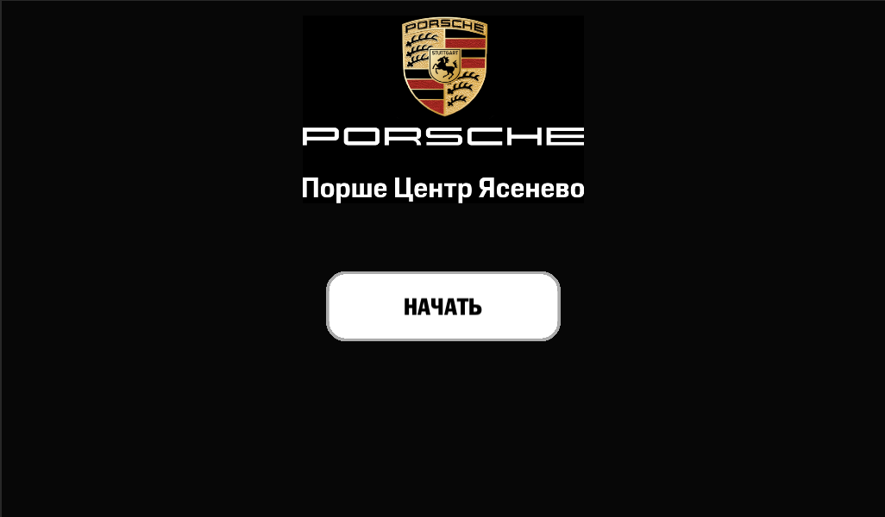
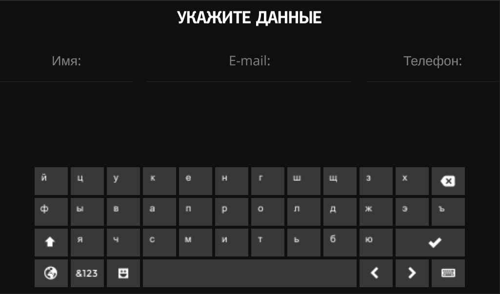
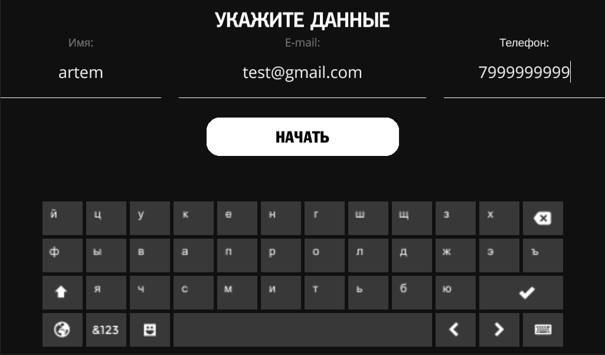
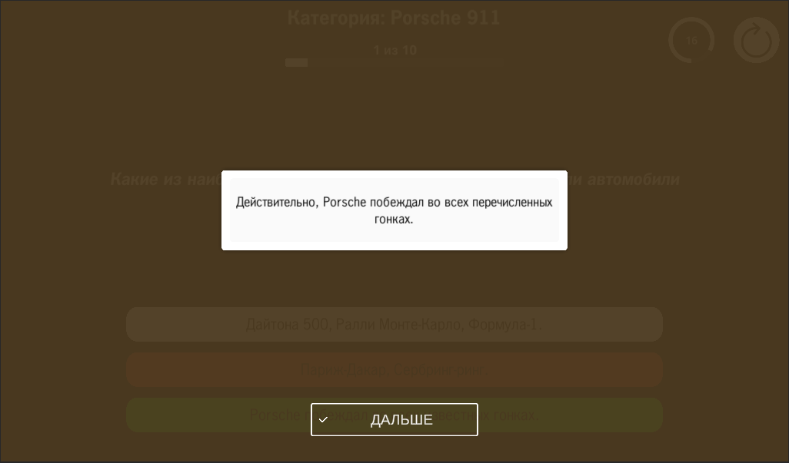
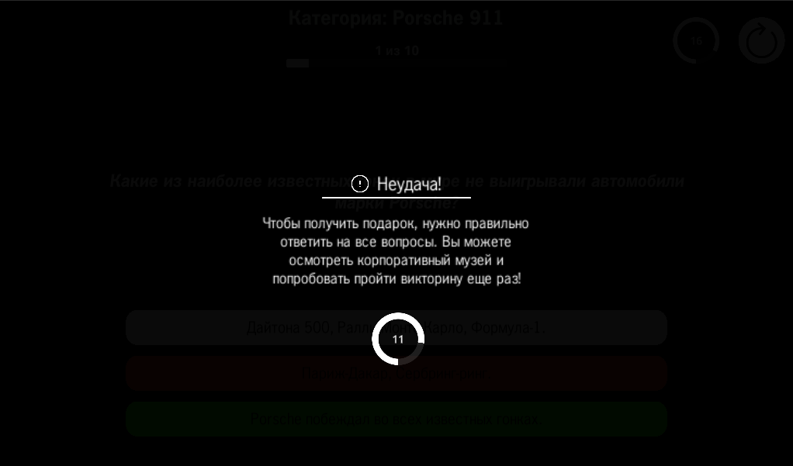
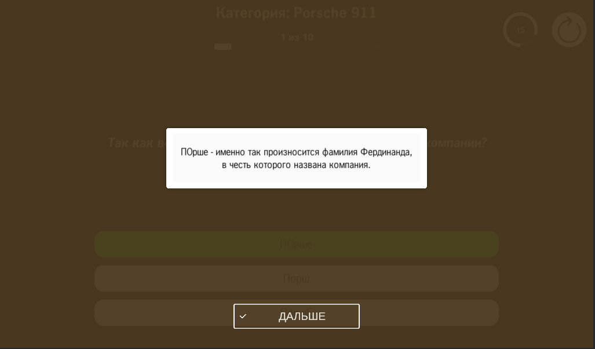

# Quize
Quiz for Porsche center Yasenevo

The quiz consisted of several questions about the history of the company, before the start of the quiz, the player was
asked to enter his data: name, phone, email. If the player made a mistake during the quiz, the
correct answer was displayed to him, a small time report began, after which the player could
try again. In case of correct completion of the quiz, the application sends a letter to the player and the manager of the company.

A little documentation:

The quiz can be customized, among the parameters:

1) The number of mistakes allowed to win
2) Response time
3) Exit time after defeat/victory
4) Questions in the quiz
5) The time between the output of the question elements (question, picture, answer options)

My tasks in the project are: developing a module for working with email, creating a player profile, working with a virtual keyboard, creating scripts for UI, layout, searching for bugs and errors.

The quiz questions are parsed from a Json file

The order was taken on a freelance basis, the deadline is two weeks.

Some beautiful screenshots:

Start menu

Empty input fields

Input fields

Wrong answer

Lose

Right answer

